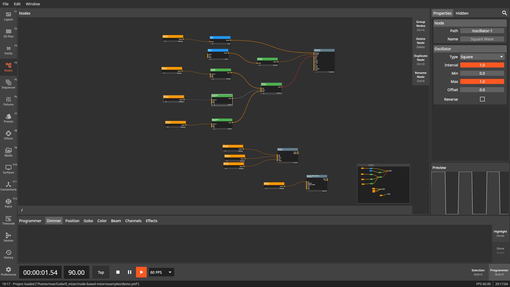

= Mizer

[.text-center]
**A node based visualization tool for live scenarios (e.g. concerts and clubs).**

[.text-center]
https://mizer.live[mizer.live]

[.text-center]
image:https://github.com/maxjoehnk/Mizer/actions/workflows/build.yml/badge.svg[Build Status, link=https://github.com/maxjoehnk/Mizer/actions/workflows/build.yml]
image:https://img.shields.io/badge/docs-blue[Documentation link,link=https://docs.mizer.live]
image:https://img.shields.io/badge/license-AGPL_3.0-purple[Documentation link,link=https://docs.mizer.live]

Mizer combines a node based workflow with a classic fixture and programmer based workflow to create a powerful and flexible tool for live visualizations.

== Development

For advanced documentation please go to https://docs.mizer.live[]

=== Dependencies

include::docs/modules/development/partials/dependencies.adoc[]

=== Building

include::docs/modules/development/partials/building.adoc[]
