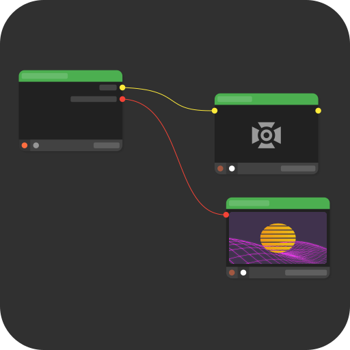

# Mizer



A node based visualization tool for live scenarios (e.g. concerts and clubs).


## Development

### Dependencies

You need to have the following tools installed:

- Rust (stable)
- cbindgen
- Flutter SDK
- protoc
- LLVM
- lld (only on linux)

### Building

#### 1. Clone the repository

```bash
git clone https://github.com/maxjoehnk/Mizer.git
cd Mizer
```

#### 2. Initial build with make

Run `make build` in the Project root. This will generate any necessary source files and also build the dynamic libraries required for the ui.

#### 3. Running

After running `make build` once you can just use `cargo run` to start Mizer.
