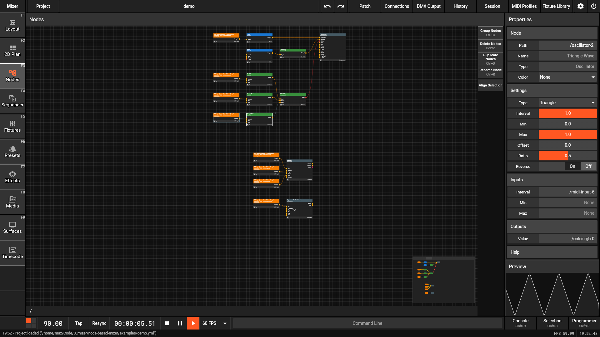

# Mizer

A node based visualization tool for live scenarios (e.g. concerts and clubs).

## Development

### Dependencies

You need to have the following tools installed:

* Rust
* cbindgen
* Flutter SDK
* protoc
* LLVM

### Building

Run `make build` in the Project root. This will place the `mizer` binary in the `target/debug` folder.

After running `make build` once you can also use all `cargo` commands directly.

### Running

To run just execute the binary or use `make run`.
